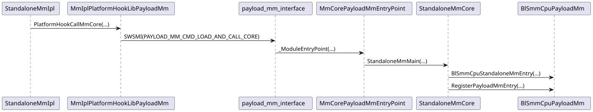
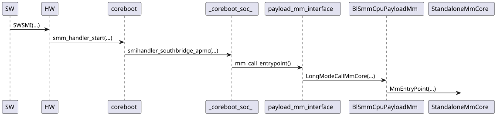

# Payload MM

## Introduction

Payload MM is a new feature that enables a bootloader and payload to share the SMM environment.
The objective is to allow the payload to install feature-specific handlers, while keeping the
ownership, initialisation and silicon-specific components of SMM in the bootloader, where they
belong. An example use-case - and the primary one prepared for support at this time - is UEFI
secure boot with authenticated variables at runtime inside SMM.

A key objective of the payload MM design is to decouple the bootloader and payload, and avoid
modifications to either of their codebases. This reduces the maintenance burden.

> [**!CAUTION**]
> With regards to security, it is critical that the payload MM support in the bootloader is
> only enabled when using a payload that supports it. To an attacker, this allows executing
> code in the context of SMM by design.

## Implementation considerations

There are several things that payload MM implementations have to take into account:

### Preserve hardware state

The payload should not make assumptions that CPU features are enabled or not. For example, if
FPU registers are required, the intermediate payload MM code must fxsave/fxrstor and enable
these before entering the actual payload.

### Calling conventions

The bootloader always calls payload MM in its native bitness (32-bit vs 64-bit, little-endian vs
big-endian), and in the System-V ABI. If the payload code's bitness is different, or if the
payload uses a different ABI, then it is the responsibility of payload MM 'glue' code to check
and perform a mode switch and/or ABI switch as needed.

Mode switches are easier to do at runtime than during initialisation, since the loaded module(s)
can check the coreboot table with the tag `LB_TAG_PLD_MM_INTERFACE_INFO` for the bootloader's
bitness and reference relevant functions as if they were variables. In contrast, during
initialisation, the loader might only be able to reference the MM core's entrypoint (via the
ELF/PE-COFF header).

A possible solution to this involves storing a custom struct in the data section of the MM
core, tagged with a magic value and referencing multiple possible entrypoints, scanning the
data section's memory in the loader module and then choosing which entrypoint to provide to
the bootloader in the `struct payload_mm_load_context`.

#### Discerning between x86-32 and x86-64

If one only needs to differentiate between x86-32 and x86-64, the easiest way involves using
one-byte `inc` opcodes that are repurposed as REX prefixes in 64-bit mode:

```
xor     eax,eax ; Clear ZF
db      0x40    ; 32-bit: inc eax   64-bit: REX prefix
nop             ; EAX is 1 if running in 32-bit mode
```

### Shared information

The first 4K of the payload MM subregion is reserved for any data that shall be shared between
the bootloader and payload MM.
- The first half of this contains a `struct payload_mm_shared_info`. Its purpose is to
  provide a runtime entrypoint to payload MM to the bootloader.
- The second half of this shall be the physical location of the
  `struct payload_mm_core_call_context` for which coreboot passes MM a pointer as an
  argument on the first entry. This data must be here, as it must be in memory mapped by MM.

```C
/*
 * The data below is shared between the bootloader and payload MM in the shared memory, located
 * in the first half of the first 4K of the payload MM subregion. It must be provided by the
 * payload MM at runtime, as it describes the data required by the bootloader to call payload MM.
 */
#define PLD_MM_SHARED_STRUCT_MAGIC	0x5f4d4d5f444c505f  /* '_PLD_MM_' */
#define PLD_MM_SHARED_STRUCT_MAX_SIZE 	2048
#define PLD_MM_SHARED_STRUCT_REVISION	1

struct payload_mm_shared_info {
	uint64_t header_magic;
	uint16_t shared_info_size;
	uint8_t  header_revision;
	uint8_t  reserved;
	uint32_t mm_entrypoint_address;
} __packed;
```

## Hand-off

The bootloader hands off some data to describe the SMRAM regions and SMI interface it provides.

### `LB_TAG_PLD_MM_INTERFACE_INFO == 0x003b`

This contains the SWSMI number of the payload MM interface, necessary for initialisation, and
the bootloader's own bitness, for the payload to determine if runtime mode switches are necessary.

```C
struct lb_payload_mm_interface_info {
	uint32_t tag;
	uint32_t size;
	uint8_t revision;			/* The version of this table. Currently "0" */
	uint8_t bootloader_smm_is_64bit;	/* Whether the bootloader's SMM is 64-bit code. This aids
						   the payload determine if mode switching is required. */
	uint8_t apm_cmd;			/* The command byte to write to the APM I/O port */
	uint8_t pad;
};
```

### `LB_TAG_PAYLOAD_MM_SMRAM_REGION == 0x003c`

This describes the 'region' within the payload MM subregion which the payload is permitted to use.

```C
struct lb_pld_mm_smram_descriptor {
	lb_uint64_t physical_start;	/* Physical address of the descriptor */
	lb_uint64_t physical_size;	/* Size of the described region */
};

struct lb_payload_mm_smram_region {
	uint32_t tag;
	uint32_t size;
	struct lb_pld_mm_smram_descriptor descriptor;	/* The payload MM subregion */
};
```

### `LB_TAG_PAYLOAD_MM_SHARED_MEM == 0x003d`

This describes the 'region' within the payload MM subregion which the payload is directed to
reserve as the shared memory.

```C
struct lb_pld_mm_smram_descriptor {
	lb_uint64_t physical_start;	/* Physical address of the descriptor */
	lb_uint64_t physical_size;	/* Size of the described region */
};

struct lb_payload_mm_shared_mem {
	uint32_t tag;
	uint32_t size;
	struct lb_pld_mm_smram_descriptor comm_buffer;	/* The shared memory */
};
```

### `LB_TAG_PLD_SPI_FLASH_INFO == 0x003e`

**TODO: Slated for removal (too complicated)**

Finally, use-case specific data. For instance, data about the SPI controller, used for enabling
variable storage. The FMAP would also be parsed by the payload for this purpose.

```C
enum lb_pld_efi_acpi_3_0_memory_types {
	PLD_EFI_ACPI_3_0_SYSTEM_MEMORY = 0,
	PLD_EFI_ACPI_3_0_SYSTEM_IO,
	PLD_EFI_ACPI_3_0_PCI_CONFIGURATION_SPACE,
};

struct lb_pld_generic_register {
	uint8_t address_space_id;	/* The address space where this register is found.
					   Follows the ACPI types */
	uint8_t register_bit_width;	/* The width of this register */
	uint8_t register_bit_offset;	/* The offset into this register to use */
	uint8_t reserved;
	lb_uint64_t address;		/* The address of this register. Exact location
					   depends on the address space */
	lb_uint64_t value;		/* An optional value to set in this register */
};

#define FLAGS_SPI_DISABLE_SMM_WRITE_PROTECT (1 << 0)
struct lb_pld_mm_spi_controller_info {
	uint32_t tag;
	uint32_t size;
	uint16_t revision;				/* The version of this table. Currently "0" */
	uint16_t flags;					/* A set of flags to describe this SPI controller, defined above */
	struct lb_pld_generic_register spi_address;	/* The address of the PCIe SPI controller, if present */
};
```

## SMI handler interface

The bootloader implements the following SMI handler interface.
- The ABI follows the one that's also used in other coreboot drivers, with `ah` containing the
  sub-command, `rbx` containing a function argument, and `rax` containing the return value.
  - Commands either return `PAYLOAD_MM_RET_SUCCESS == 0` or `PAYLOAD_MM_RET_FAILURE == 1`.

### `LOAD_AND_CALL_CORE == 1`

`memcpy`'s the provided buffer into the payload region, and calls the provided entrypoint,
passing a `struct payload_mm_core_call_context *`, which is a subset of the load context. For
the purposes of consumer-specific extensibility, an `implementation_private_data` field is
present in the load context, that will be copied to the call context, conveying relevant
information from the unprivileged environment to the privileged one.

The provided buffer must be reachable by the bootloader. Therefore, it must be below 4 GiB when
the bootloader declares that its SMM is 32-bit code, per LB\_TAG\_PLD\_MM\_INTERFACE\_INFO.

The `struct payload_mm_core_call_context` must be in memory that will be mapped by MM. The
primary implementation of payload MM does not map the coreboot area, and for security reasons, no
implementation should. Therefore, this struct should be in the second half of the shared memory.

Input: A pointer to a `struct payload_mm_load_context`.

```C
/*
 * The data below describes a load request from the payload MM loader (ring0) to bootloader SMM,
 * and the arguments that the loader wants passed to the payload MM core module.
 */
#define PLD_MM_LOAD_CONTEXT_REVISION	1

struct payload_mm_load_context {
	uint16_t header_size;
	uint8_t  header_revision;
	uint8_t  reserved;
	uint64_t mm_core_source_address;
	uint32_t mm_core_destination_address;
	uint32_t mm_core_size;
	uint32_t mm_entrypoint_offset;
	uint64_t mm_entrypoint_arg1;
	uint64_t mm_entrypoint_arg2;
	uint64_t mm_entrypoint_arg3;
	uint64_t implementation_private_data;
} __packed;

/*
 * Used to communicate payload MM loader (ring0) arguments from bootloader SMM to payload MM.
 */
struct payload_mm_core_call_context {
	uint64_t mm_entrypoint_arg1;
	uint64_t mm_entrypoint_arg2;
	uint64_t mm_entrypoint_arg3;
	uint64_t implementation_private_data;
} __packed;
```

## Sequence

### Initialisation

The payload shall first prepare a buffer representing the MM core module outside of SMRAM, but
relocated (if necessary) to match its final destination. Then it will call **LOAD_AND_CALL_CORE**
in the above SMI handler. The bootloader will start payload MM for the first time, and before it
exits, it shall select an appropriate function for the bootloader to call at runtime, and copy
the address into the shared memory region. Now, payload MM is initialised, and the above SMI
handler is disabled.

An example initialisation control flow (from payload MM IPL onwards) is below:



### Runtime

The bootloader shall call the payload MM for relevant SMIs. Currently, these only include APMCs,
which form the basis of UEFI's SMM communication, but this can be extended if ever necessary.
Currently, the payload MM design contains no features that require passing data at runtime, so
the bootloader simply passes a `NULL` pointer (for forwards compatibility), although in time,
we may support MP and save state modification, and will develop another struct to address this.

An example runtime control flow (from delivery of an APMC to the HW) is below:



### S3 resume

Payload MM implementations remain in-place through S3 resumes. The shared memory region will
also be preserved, and so the bootloader will continue to find payload MM as usual.

## Addendum: Payload components

UefiPayload's implementation:
- MmIplPlatformHookLibPayloadMm: Linked into the payload MM IPL to load the MM core *through*
  the bootloader SMI interface.
- MmCorePayloadMmEntryPoint: Provides the MM core's true entrypoint, transferring execution and
  returning back upon load.
- BlSmmCpuPayloadMm: Adapted from PiSmmCpuDxeSmm for our purposes. Implements the payload MM
  glue, registering our function to transfer execution from the bootloader and return back (ABI
  and mode switch, as required).

## Addendum: Notes and Open Issues

The [Star Labs preference interface](starlabs_preferences.md) is a bounded
ACPI consumer of the resident variable service, separate from the loader ABI.

**Open tasks**:
- Consider using the MM supervisor in UefiPayload (and directing payloads to strongly consider
  old and new security measures), this requires enhancing the supervisor first.

**Open questions**:
- How to avoid SWSMI number conflict?
  - In practice, this may not be an issue (yet). EDK2 uses `APM_CNT_NOOP_SMI` and its own communication buffers.
